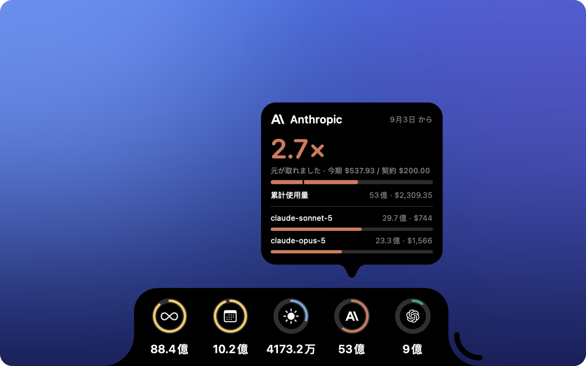

<div align="center">


# TokNotch

**その AI プラン、何倍の元が取れていますか？**

<a href="https://github.com/ReffWu/toknotch/releases/latest/download/TokNotch.dmg">
  <picture>
    <source media="(prefers-color-scheme: dark)" srcset="docs/assets/readme/download-ja-dark.png">
    
  </picture>
</a>

<sub>無料 · macOS 14 以降 · Apple による署名と公証済み</sub>

[English](README.md) · [简体中文](README.zh-CN.md) · [繁體中文](README.zh-TW.md) · 日本語 · [한국어](README.ko.md)

</div>

<p align="center">
  
</p>

---

Claude Code、Codex などを公開 API 料金で換算して、画面の端に。

毎月いくら払っているかは知っている。それで何を得たかは知らない。

TokNotch は、コーディングツールが実際に動かした量をすべて足し合わせ、同じ作業を公開
API 料金でこなしたらいくらになるかで換算して、数字をひとつだけ見せます。

<div align="center">

### **13.4 倍の元が取れた**

</div>

まだ元が取れていないプランなら、こう言います：**あと $18**。

---

## 回収倍率

プランの料金と更新日を TokNotch に伝える。設定はそれだけです。

**Claude Code** なら、たいてい聞かれることすらありません —— プランは Claude Code が
もともと保存している普通の設定ファイル `~/.claude.json` から読み取られます。**Codex** の
ChatGPT プランも同じです。それ以外はリストから名前で選ぶだけ（Claude Pro、ChatGPT Plus、
Google AI Ultra…）。料金を調べる必要はなく、好きな金額を入れることもできます。

そして**暦の月ではなく、実際の請求期間で**数えます。3 日に請求されるプランが買っているのは
3 日から翌月 2 日まで。1 日から数えると、前回の支払いですでにカバーされた日々が紛れ込み、
2 日にはほぼ一期間ぶん、別の支払いの使用量になってしまいます。

---

## そして、いつもそこにある 3 つのリング

**今日 · 今月 · これまで。** 画面の端に、トークン数。

弧は飾りではありません。今日は**直近 30 日でいちばん使った日**と、今月は**先月の同じ日々**と、
これまでは**次のマイルストーン**と比べています。どのカードも、何と比べているかを書いています。

リングが一周するのは、自己ベストを更新したということ。警告ではありませんし、ここに
使い切るものは何もありません。

---

## 何を数えるか

コーディングツールが実際に動かしたすべてを、**請求した会社ではなくモデルを作った会社**で
まとめます。ローカルで動かした Qwen も Qwen として、他社プラン経由で請求された GLM も
Zhipu として数えます。

> Anthropic · OpenAI · Google · DeepSeek · Qwen · Zhipu GLM · Moonshot Kimi ·
> MiniMax · xAI · Xiaomi MiMo · NVIDIA · Meta · Mistral

それぞれ専用のリングを持てます。**初期状態ではすべてオフ**で、選べるリストはこの Mac が
実際に動かした記録から作られます。使ったことのない会社は出てきません。

集計は [tokscale](https://github.com/junhoyeo/tokscale) が行い、アプリに内蔵されています。

---

## インストールするものはなし。Mac から何も出ていかない。

Homebrew も npm も Node も不要。アカウントもサインインも API キーもいりません。

TokNotch が読むのは、コーディングツールがホームフォルダにもともと書いているセッション
ログです。キーチェーンは開かず、パスワードを尋ねることもなく、何もどこにも送りません。

はっきり書いておくべき例外は Codex です。そのプランは `~/.codex/auth.json` にあり、これは
**まさに**認証情報のファイルです。そこから読むのはプランに関する 3 項目 —— プランの種類と
2 つの日付だけ。隣にあるアクセストークン、リフレッシュトークン、API キーは読まず、
コピーせず、記録もしません。

---

## どこに置くか

**4 辺のどこにでも。** 左右なら細い縦長の列、上下なら幅の広いバー。ノッチのある MacBook
では、上端がノッチまで伸びて、ふたつがひとつの形に見えます —— だからノッチのある Mac では最初からそこに置かれます。

**必要になるまで控えめに。** 普段は端に小さなピルがあるだけで、近づくと開きます。いつも
開いたままにもできます。

**Dock には標準で表示されません。** メニューバーの小さなアイコンを開くと、今期の回収倍率、今日・今月・累計がひと目でわかるパネルが出ます。Dock に置きたければ設定でオンにできます。

Dock とメニューバーの位置を把握していて、それらが動けば一緒に動きます。

---

## あなたの言語で

English · 简体中文 · 繁體中文 · 日本語 · 한국어 · Deutsch · Français · Español · Italiano ·
Português (Brasil) · Nederlands · Polski · Русский · Türkçe · Tiếng Việt · العربية

言葉だけではありません。数字、金額、日付もそれぞれの言語の流儀に従います —— 中国語と
日本語では万と億、英語では k/M/B、ドイツ語では Mrd.。

---

## 手に入れる

[TokNotch.dmg をダウンロード](https://github.com/ReffWu/toknotch/releases/latest/download/TokNotch.dmg)
して開き、TokNotch を「アプリケーション」へドラッグしてください。Developer ID で署名され
Apple の公証を受けているので、ほかのアプリと同じように開けます。以降は Mac の起動時に
自動で立ち上がり、自分で最新に保ちます。すべてのビルドは
[Releases ページ](https://github.com/ReffWu/toknotch/releases)にあります。

**macOS 14 (Sonoma) 以降が必要です。**

### 自分でビルドする

```sh
brew install xcodegen
make run
```

ad-hoc 署名の Debug ビルドができ、手元で動かして開発するにはこれで十分です。そのほかは
[CONTRIBUTING.md](CONTRIBUTING.md)、リリースの手順は [docs/RELEASING.md](docs/RELEASING.md) を
ご覧ください。

---

## 中身

[docs/ARCHITECTURE.md](docs/ARCHITECTURE.md) で各部分を説明しています。ひとことで言えば、
本物のノッチの形を描く枠なしの `NSPanel`、内蔵の tokscale を呼び出すポーラー、そして
端から開く SwiftUI のカードです。

---

## クレジット

TokNotch は [vinzdg/codenotch](https://github.com/vinzdg/codenotch) のフォークから始まり、
ローカルの使用量集計を軸に書き直されました。元のプロジェクトは MIT ライセンスで、その
著作権表示は [LICENSE](LICENSE) に残しています。

使用量は [tokscale](https://github.com/junhoyeo/tokscale)（MIT）によるもので、
`Vendor/tokscale/` に同梱しています。アップデートには [Sparkle](https://sparkle-project.org)（MIT）
を使っています。[THIRD_PARTY_NOTICES.md](THIRD_PARTY_NOTICES.md) もご覧ください。

## ライセンス

[MIT](LICENSE)。
