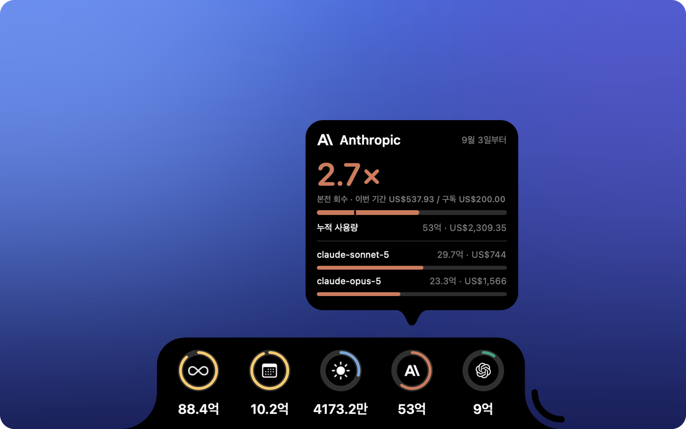

<div align="center">


# TokNotch

**내 AI 요금제, 몇 배나 본전을 뽑았을까?**

<a href="https://github.com/ReffWu/toknotch/releases/latest/download/TokNotch.dmg">
  <picture>
    <source media="(prefers-color-scheme: dark)" srcset="docs/assets/readme/download-ko-dark.png">
    
  </picture>
</a>

<sub>무료 · macOS 14 이상 · Apple 서명 및 공증 완료</sub>

[English](README.md) · [简体中文](README.zh-CN.md) · [繁體中文](README.zh-TW.md) · [日本語](README.ja.md) · 한국어

</div>

<p align="center">
  
</p>

---

Claude Code, Codex 등을 공개 API 요금으로 환산해 화면 가장자리에.

매달 얼마를 내는지는 압니다. 그만큼 무엇을 얻었는지는 모릅니다.

TokNotch는 코딩 도구가 실제로 돌린 양을 모두 더하고, 같은 작업을 공개 API 요금으로 했다면
얼마였을지로 환산해 숫자 하나만 보여 줍니다.

<div align="center">

### **13.4배 회수**

</div>

아직 본전을 못 뽑은 요금제라면 이렇게 말합니다: **$18 남음**.

---

## 회수 배수

요금제가 얼마인지, 언제 갱신되는지 TokNotch에 알려 주세요. 설정은 그게 전부입니다.

**Claude Code**라면 대개 묻지도 않습니다 —— 요금제는 Claude Code가 원래 저장해 두는 평범한
설정 파일 `~/.claude.json`에서 알아냅니다. **Codex**의 ChatGPT 요금제도 마찬가지입니다.
나머지는 목록에서 이름으로 고르면 됩니다(Claude Pro, ChatGPT Plus, Google AI Ultra…).
가격을 찾아볼 필요 없이, 원하는 금액을 직접 넣을 수도 있습니다.

그리고 **달력의 달이 아니라 실제 청구 기간으로** 셉니다. 3일에 청구되는 요금제가 산 것은
3일부터 다음 달 2일까지입니다. 1일부터 세면 지난 결제가 이미 덮은 날들이 슬쩍 섞여 들어오고,
매달 2일에는 거의 한 기간 전체가 다른 결제의 사용량이 됩니다.

---

## 그리고 늘 켜져 있는 세 개의 링

**오늘 · 이번 달 · 전체.** 화면 가장자리에 토큰 수를.

호는 장식이 아닙니다. 오늘은 **최근 30일 중 가장 많이 쓴 날**과, 이번 달은 **지난달 같은
날들**과, 전체는 **다음 이정표**와 비교합니다. 모든 카드가 무엇과 비교하는지 알려 줍니다.

링이 가득 찼다면 자신의 기록을 넘어섰다는 뜻입니다. 경고가 아니며, 여기에는 다 써 버릴
한도도 없습니다.

---

## 무엇을 세는가

코딩 도구가 실제로 돌린 모든 것을 **누가 청구했는지가 아니라 누가 모델을 만들었는지**로
묶습니다. 로컬에서 돌린 Qwen도 Qwen으로, 다른 요금제로 청구된 GLM도 Zhipu로 셉니다.

> Anthropic · OpenAI · Google · DeepSeek · Qwen · Zhipu GLM · Moonshot Kimi ·
> MiniMax · xAI · Xiaomi MiMo · NVIDIA · Meta · Mistral

회사마다 링을 따로 둘 수 있습니다. **기본값은 모두 꺼짐**이고, 고를 수 있는 목록은 이 Mac이
실제로 돌린 기록으로 만들어집니다. 써 본 적 없는 회사는 나타나지 않습니다.

집계는 앱에 내장된 [tokscale](https://github.com/junhoyeo/tokscale)이 합니다.

---

## 설치할 것도, Mac 밖으로 나가는 것도 없습니다

Homebrew도, npm도, Node도 필요 없습니다. 계정도, 로그인도, API 키도 없습니다.

TokNotch는 코딩 도구가 홈 폴더에 원래 남기는 세션 기록을 읽습니다. 키체인을 열지 않고,
암호를 묻지 않으며, 어디로도 아무것도 보내지 않습니다.

분명히 짚고 넘어갈 예외가 Codex입니다. 요금제 정보가 `~/.codex/auth.json`에 있는데, 이것은
**실제로** 자격 증명 파일입니다. 여기서는 요금제에 관한 세 항목 —— 요금제 종류와 날짜 두 개만
읽습니다. 바로 옆의 액세스 토큰, 리프레시 토큰, API 키는 읽지도, 복사하지도, 기록하지도 않습니다.

---

## 어디에 두는가

**네 가장자리 중 어디든.** 왼쪽이나 오른쪽이면 가느다란 세로줄, 위나 아래면 넓은 막대입니다.
노치가 있는 MacBook에서는 위쪽 막대가 노치까지 이어져 둘이 하나의 모양으로 보입니다 —— 그래서 노치가 있는 Mac에서는 처음부터 그곳에 놓입니다.

**필요할 때까지 조용히.** 평소에는 가장자리의 작은 알약 모양이다가, 다가가면 펼쳐집니다.
항상 펼쳐 둘 수도 있습니다.

**기본적으로 Dock을 차지하지 않습니다.** 메뉴 막대의 작은 아이콘을 누르면 이번 기간 회수 배수와 오늘·이번 달·누적이 한눈에 보이는 패널이 열립니다. Dock에 두고 싶다면 설정에서 켜면 됩니다.

Dock과 메뉴 막대의 위치를 알고 있어서, 그것들이 움직이면 함께 움직입니다.

---

## 당신의 언어로

English · 简体中文 · 繁體中文 · 日本語 · 한국어 · Deutsch · Français · Español · Italiano ·
Português (Brasil) · Nederlands · Polski · Русский · Türkçe · Tiếng Việt · العربية

말만 바뀌는 것이 아닙니다. 숫자, 금액, 날짜도 각 언어의 방식을 따릅니다 —— 한국어는 만과 억,
영어는 k/M/B, 독일어는 Mrd.로.

---

## 설치하기

[TokNotch.dmg 다운로드](https://github.com/ReffWu/toknotch/releases/latest/download/TokNotch.dmg)
후 열어서 TokNotch를 응용 프로그램 폴더로 드래그하세요. Developer ID로 서명되고 Apple의 공증을
받아 다른 앱처럼 바로 열리며, 이후에는 Mac을 켤 때 자동으로 실행되고 스스로 최신 상태를
유지합니다. 모든 빌드는 [Releases 페이지](https://github.com/ReffWu/toknotch/releases)에 있습니다.

**macOS 14 (Sonoma) 이상이 필요합니다.**

### 직접 빌드하기

```sh
brew install xcodegen
make run
```

ad-hoc 서명된 Debug 빌드가 만들어지며, 로컬에서 실행하고 개발하기에는 충분합니다. 나머지는
[CONTRIBUTING.md](CONTRIBUTING.md), 릴리스 절차는 [docs/RELEASING.md](docs/RELEASING.md)를
참고하세요.

---

## 내부 구조

[docs/ARCHITECTURE.md](docs/ARCHITECTURE.md)에서 각 부분을 설명합니다. 짧게 말하면, 실제
노치 모양을 그리는 테두리 없는 `NSPanel`, 내장 tokscale 실행 파일을 감싼 폴러, 그리고
가장자리에서 펼쳐지는 SwiftUI 카드입니다.

---

## 크레딧

TokNotch는 [vinzdg/codenotch](https://github.com/vinzdg/codenotch)의 포크로 시작해 로컬 사용량
집계를 중심으로 다시 작성되었습니다. 원래 프로젝트는 MIT 라이선스이며, 그 저작권 표시는
[LICENSE](LICENSE)에 남겨 두었습니다.

사용량 수치는 `Vendor/tokscale/`에 포함된 [tokscale](https://github.com/junhoyeo/tokscale)(MIT)에서
옵니다. 업데이트에는 [Sparkle](https://sparkle-project.org)(MIT)을 사용합니다.
[THIRD_PARTY_NOTICES.md](THIRD_PARTY_NOTICES.md)도 참고하세요.

## 라이선스

[MIT](LICENSE).
