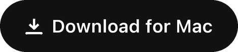
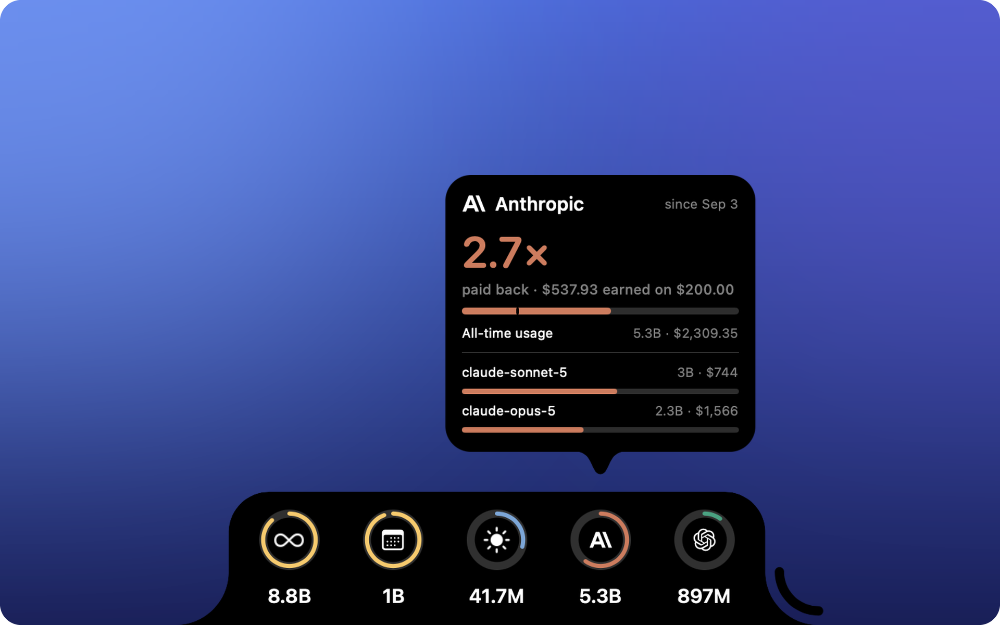

<div align="center">


# TokNotch

**How many times over has each AI plan paid for itself?**

<a href="https://github.com/ReffWu/toknotch/releases/latest/download/TokNotch.dmg">
  <picture>
    <source media="(prefers-color-scheme: dark)" srcset="docs/assets/readme/download-en-dark.png">
    
  </picture>
</a>

<sub>Free · macOS 14 or later · Signed and notarized by Apple</sub>

English · [简体中文](README.zh-CN.md) · [繁體中文](README.zh-TW.md) · [日本語](README.ja.md) · [한국어](README.ko.md)

</div>

<p align="center">
  
</p>

---

Claude Code, Codex and the rest — priced against the published API rates,
sitting at the edge of your screen.

You know what you pay every month. You don't know what you got for it.

TokNotch adds up everything your coding tools actually ran, prices it at what
the same work would have cost on the published API rates, and puts one number
in front of you:

<div align="center">

### **13.4× paid back**

</div>

Or, when a plan hasn't earned its keep yet: **$18 to go**.

---

## The payback number

Tell TokNotch what a plan costs and when it renews. That's the whole setup.

For **Claude Code** it usually doesn't even ask — the plan is recognised from
`~/.claude.json`, the ordinary config file Claude Code already keeps. For
**Codex** it reads the ChatGPT plan the same way. For everyone else you pick
your plan by name from a list (Claude Pro, ChatGPT Plus, Google AI Ultra…)
rather than looking a price up, or type any figure you like.

It then counts **by your real billing period, not the calendar month**. A plan
billed on the 3rd paid for the 3rd through the 2nd — judging it on what happened
since the 1st quietly mixes in days the last payment already covered. On the 2nd
of the month that's nearly a whole period of somebody else's usage.

---

## And three rings, always on

**Today · This month · All time.** Token counts, at the edge of the screen.

The arcs aren't decoration. Today is measured against **your best day in the
last thirty**, this month against **the same days last month**, all time against
**the next milestone**. Every card says what it's comparing against.

A full ring means you beat your own record. It's never a warning, and there's
nothing here to run out of.

---

## What it counts

Everything your coding tools have actually run, grouped by **who made the model**
rather than who billed for it — so a Qwen you ran locally still counts as Qwen,
and a GLM billed through someone else's plan still counts as Zhipu.

> Anthropic · OpenAI · Google · DeepSeek · Qwen · Zhipu GLM · Moonshot Kimi ·
> MiniMax · xAI · Xiaomi MiMo · NVIDIA · Meta · Mistral

Each can have a ring of its own. They're all **off by default**, and the list
you choose from is built from what this Mac has really run — vendors you've
never touched never appear.

The counting is done by [tokscale](https://github.com/junhoyeo/tokscale), which
ships inside the app.

---

## Nothing to install. Nothing leaves your Mac.

No Homebrew. No npm. No Node. No account, no sign-in, no API key.

TokNotch reads the session logs your coding tools already write in your home
folder. It never opens the keychain, never shows you a password prompt, and
never sends anything anywhere.

Codex is the one exception worth spelling out: its plan lives inside
`~/.codex/auth.json`, which *is* a credential file. Only the three plan claims
are ever read from it — the plan type and its dates. The access token, refresh
token and API key sitting beside them are never read, never copied, never
logged.

---

## Where it sits

**Any of the four edges.** Left or right as a slim column; top or bottom as a
wide bar. On a MacBook with a notch, the top edge runs up to meet it so the two
read as one shape — which is why that is where it starts on a Mac that has one.

**Out of the way until you want it.** At rest it's a small pill at the edge —
reach for it and it opens. Or keep it open always.

**Out of your Dock unless you want it.** A small icon in the menu bar opens a
panel with this period's payback, today, this month and all time. Settings
can put it in the Dock too.

It knows about your Dock and your menu bar, and moves when they do.

---

## It speaks your language

English · 简体中文 · 繁體中文 · 日本語 · 한국어 · Deutsch · Français · Español · Italiano ·
Português (Brasil) · Nederlands · Polski · Русский · Türkçe · Tiếng Việt · العربية

Not just the words. Numbers, money and dates follow each language's own
conventions — 万 and 亿 in Chinese, k/M/B in English, Mrd. in German.

---

## Getting it

[Download TokNotch.dmg](https://github.com/ReffWu/toknotch/releases/latest/download/TokNotch.dmg),
open it and drag TokNotch to Applications. It is signed with a Developer ID and
notarized by Apple, opens like any other app, starts with your Mac, and keeps
itself up to date after that. Every build is on the
[Releases page](https://github.com/ReffWu/toknotch/releases).

**Requires macOS 14 (Sonoma) or newer.**

### Building it yourself

```sh
brew install xcodegen
make run
```

A Debug build, ad-hoc signed, which is enough to run and develop against.
See [CONTRIBUTING.md](CONTRIBUTING.md) for the rest, and
[docs/RELEASING.md](docs/RELEASING.md) for how a release is cut.

---

## Under the hood

[docs/ARCHITECTURE.md](docs/ARCHITECTURE.md) walks through the pieces. The short
version: a borderless `NSPanel` that draws a real notch shape, a poller around
the bundled tokscale binary, and a SwiftUI card that unfolds out of the edge.

---

## Credits

TokNotch began as a fork of [vinzdg/codenotch](https://github.com/vinzdg/codenotch)
and was rewritten around local usage accounting. The original is MIT licensed and
its copyright is kept in [LICENSE](LICENSE).

Usage figures come from [tokscale](https://github.com/junhoyeo/tokscale) (MIT),
bundled in `Vendor/tokscale/`. Updates use [Sparkle](https://sparkle-project.org) (MIT).
See [THIRD_PARTY_NOTICES.md](THIRD_PARTY_NOTICES.md).

## License

[MIT](LICENSE).
