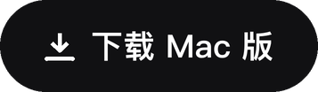
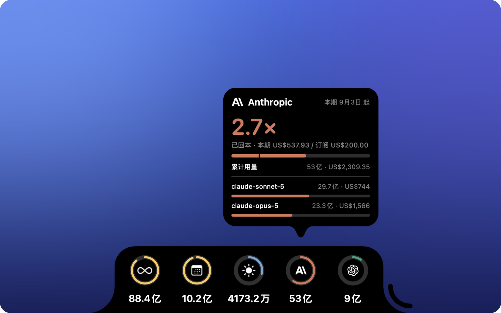

<div align="center">


# TokNotch

**你的每个 AI 套餐，到底回本了几倍？**

<a href="https://github.com/ReffWu/toknotch/releases/latest/download/TokNotch.dmg">
  <picture>
    <source media="(prefers-color-scheme: dark)" srcset="docs/assets/readme/download-zh-Hans-dark.png">
    
  </picture>
</a>

<sub>免费 · macOS 14 或更新版本 · 经 Apple 签名与公证</sub>

[English](README.md) · 简体中文 · [繁體中文](README.zh-TW.md) · [日本語](README.ja.md) · [한국어](README.ko.md)

</div>

<p align="center">
  
</p>

---

Claude Code、Codex 等等 —— 按官方 API 公开价折算，就摆在屏幕边上。

你知道自己每个月付了多少。你不知道自己到底拿回了多少。

TokNotch 把你的编码工具真正跑掉的量全部加起来，按官方 API 的公开价折算成同样工作的
价钱，然后只给你一个数字：

<div align="center">

### **已回本 13.4 倍**

</div>

如果这个套餐还没赚回来，它就说：**还差 $18**。

---

## 回本倍数

告诉 TokNotch 这个套餐多少钱、哪天扣费。设置就这么多。

**Claude Code** 通常连问都不用问 —— 套餐是从 `~/.claude.json` 认出来的，那本来就是
Claude Code 自己存的普通配置文件。**Codex** 的 ChatGPT 套餐同理。其余的，你从列表里
按名字挑（Claude Pro、ChatGPT Plus、Google AI Ultra…），不用去查价格，也可以随便填
一个数。

然后它**按你真实的计费周期算，不是自然月**。3 号扣费的套餐，买的是 3 号到下月 2 号；
如果从 1 号开始算，就悄悄把上一笔钱已经覆盖的那几天混了进来 —— 在每月 2 号，那几乎是
一整个周期的别人的用量。

---

## 还有三个常驻的环

**今日 · 本月 · 累计。** Token 数，就在屏幕边上。

弧度不是装饰。今日对比的是**最近三十天里你最猛的那一天**，本月对比的是**上个月同样
这几天**，累计对比的是**下一个里程碑**。每张卡片都写清楚它在跟什么比。

环走满，意味着你破了自己的纪录。它从来不是警告，这里也没有任何额度会被用完。

---

## 它统计什么

你的编码工具真正跑过的一切，归类按**谁造的模型**而不是按谁收的钱 —— 所以本地跑的
Qwen 仍然算通义千问，挂在别人套餐上计费的 GLM 仍然算智谱。

> Anthropic · OpenAI · Google · DeepSeek · 通义千问 · 智谱 GLM · 月之暗面 Kimi ·
> MiniMax · xAI · 小米 MiMo · NVIDIA · Meta · Mistral

每家都可以单独占一个环。它们**默认全部关闭**，而且可选列表是由这台 Mac 真实跑过的
记录生成的 —— 你没用过的厂商，压根不会出现。

统计由 [tokscale](https://github.com/junhoyeo/tokscale) 完成，它已经内置在 App 里。

---

## 什么都不用装，什么都不外传

不需要 Homebrew，不需要 npm，不需要 Node。不用注册，不用登录，不用 API Key。

TokNotch 读的是你的编码工具本来就在家目录里写下的会话日志。它不碰钥匙串，不会弹密码
框，也不会把任何东西发到任何地方。

Codex 是唯一值得单独说清楚的例外：它的套餐信息存在 `~/.codex/auth.json` 里，那**确实**
是个凭据文件。从里面只读三项套餐声明 —— 套餐类型和两个日期。旁边的 access token、
refresh token 和 API Key 一概不读、不复制、不记录。

---

## 它待在哪

**四条边随便挑。** 左右是一根细长的竖条，上下是一道横贯的宽条。在带刘海的 MacBook 上，
顶边会一直延伸上去与刘海相接，两者看起来是同一个形状 —— 所以有刘海的 Mac 默认就放在这里。

**不打扰，要看才出来。** 平时只是边上一枚小药丸，鼠标靠过去才展开。也可以让它一直开着。

**不占 Dock。** 只在菜单栏留一个小图标，点开就能看到本期回本几倍、今天用了多少。

它认得你的 Dock 和菜单栏，它们动，它跟着动。

---

## 它说你的语言

English · 简体中文 · 繁體中文 · 日本語 · 한국어 · Deutsch · Français · Español · Italiano ·
Português (Brasil) · Nederlands · Polski · Русский · Türkçe · Tiếng Việt · العربية

不只是文字。数字、金额和日期都按各自语言的习惯来 —— 中文里是万和亿，英文里是 k/M/B，
德文里是 Mrd.。

---

## 装上它

[下载 TokNotch.dmg](https://github.com/ReffWu/toknotch/releases/latest/download/TokNotch.dmg)，
打开后把 TokNotch 拖进「应用程序」。App 使用 Developer ID 签名并经过 Apple 公证，像其他
App 一样直接打开，之后会随 Mac 自动启动，也会自己保持最新。历次版本都在
[Releases 页面](https://github.com/ReffWu/toknotch/releases)。

**需要 macOS 14 (Sonoma) 或更新版本。**

### 自己编译

```sh
brew install xcodegen
make run
```

这会出一个 Debug 构建，ad-hoc 签名，足够本地运行和调试。其余细节见
[CONTRIBUTING.md](CONTRIBUTING.md)，发布流程见 [docs/RELEASING.md](docs/RELEASING.md)。

---

## 里面是怎么做的

[docs/ARCHITECTURE.md](docs/ARCHITECTURE.md) 讲了各部分的构成。一句话版本：一个无边框的
`NSPanel` 画出真实的刘海形状，一个轮询器包着内置的 tokscale 可执行文件，再加一张从边缘
展开的 SwiftUI 卡片。

---

## 致谢

TokNotch 起初 fork 自 [vinzdg/codenotch](https://github.com/vinzdg/codenotch)，
后来围绕本地用量统计做了重写。原项目采用 MIT 协议，其版权声明保留在 [LICENSE](LICENSE) 中。

用量数据来自 [tokscale](https://github.com/junhoyeo/tokscale)（MIT），内置于
`Vendor/tokscale/`。自动更新使用 [Sparkle](https://sparkle-project.org)（MIT）。
详见 [THIRD_PARTY_NOTICES.md](THIRD_PARTY_NOTICES.md)。

## 许可

[MIT](LICENSE)。
