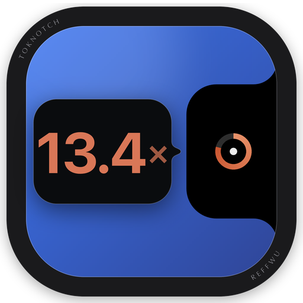
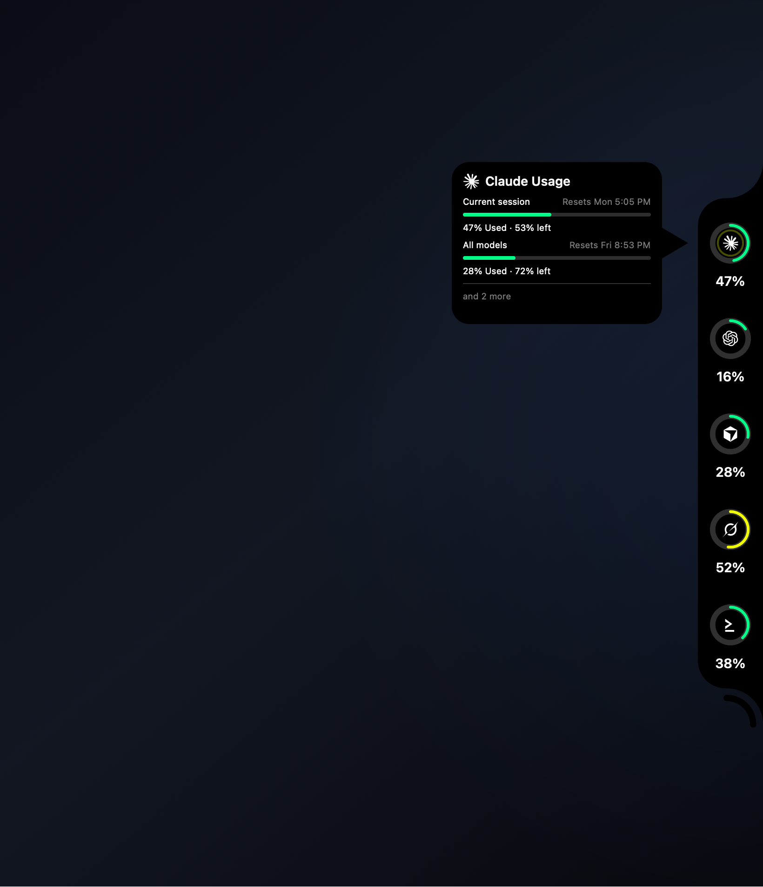
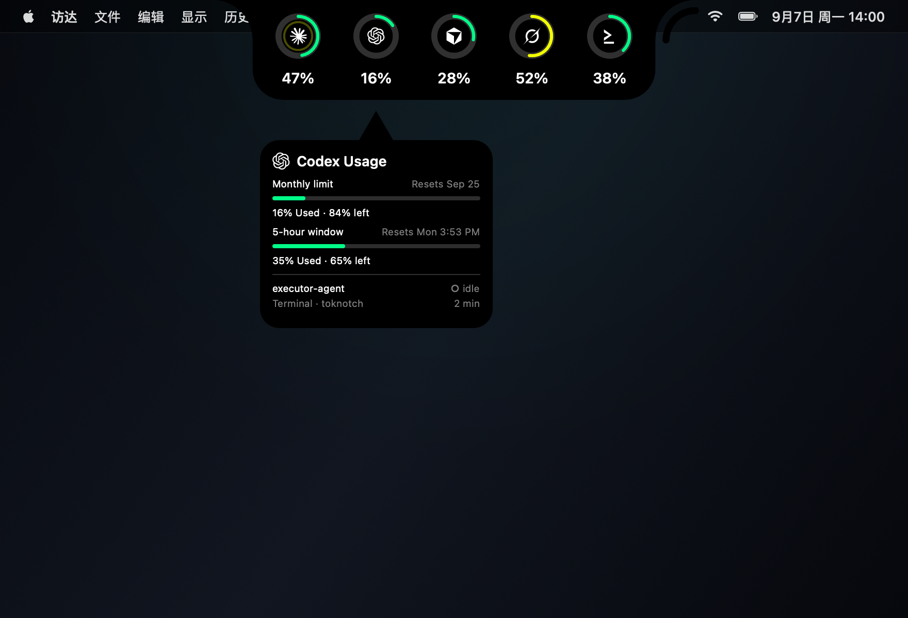

<div align="center">



# TokNotch

**你的每個 AI 方案，到底回本了幾倍？**

Claude Code、Codex 等等 —— 按官方 API 公開價折算，就擺在螢幕邊上。

[English](README.md) · [简体中文](README.zh-CN.md) · 繁體中文 · [日本語](README.ja.md) · [한국어](README.ko.md)

[](https://github.com/ReffWu/toknotch)
[](LICENSE)
[](#它說你的語言)

</div>

---

你知道自己每個月付了多少。你不知道自己到底拿回了多少。

TokNotch 把你的程式工具真正跑掉的量全部加起來，按官方 API 的公開價折算成同樣工作的
價錢，然後只給你一個數字：

<div align="center">

### **已回本 13.4 倍**

</div>

如果這個方案還沒賺回來，它就說：**還差 $18**。

<p align="center">
  
  
</p>

---

## 回本倍數

告訴 TokNotch 這個方案多少錢、哪天扣款。設定就這麼多。

**Claude Code** 通常連問都不用問 —— 方案是從 `~/.claude.json` 認出來的，那本來就是
Claude Code 自己存的一般設定檔。**Codex** 的 ChatGPT 方案同理。其餘的，你從列表裡
按名字挑（Claude Pro、ChatGPT Plus、Google AI Ultra…），不用去查價格，也可以隨便填
一個數字。

然後它**按你真實的計費週期算，不是自然月**。3 號扣款的方案，買的是 3 號到下個月 2 號；
如果從 1 號開始算，就悄悄把上一筆錢已經涵蓋的那幾天混了進來 —— 在每月 2 號，那幾乎是
一整個週期的別人的用量。

---

## 還有三個常駐的環

**今日 · 本月 · 累計。** Token 數，就在螢幕邊上。

弧度不是裝飾。今日對比的是**最近三十天裡你用得最兇的那一天**，本月對比的是**上個月同樣
這幾天**，累計對比的是**下一個里程碑**。每張卡片都寫清楚它在跟什麼比。

環走滿，代表你破了自己的紀錄。它從來不是警告，這裡也沒有任何額度會被用完。

---

## 它統計什麼

你的程式工具真正跑過的一切，歸類按**誰做的模型**而不是按誰收的錢 —— 所以本機跑的
Qwen 仍然算通義千問，掛在別人方案上計費的 GLM 仍然算智譜。

> Anthropic · OpenAI · Google · DeepSeek · 通義千問 · 智譜 GLM · 月之暗面 Kimi ·
> MiniMax · xAI · 小米 MiMo · NVIDIA · Meta · Mistral

每家都可以單獨佔一個環。它們**預設全部關閉**，而且可選列表是由這台 Mac 真實跑過的
紀錄產生的 —— 你沒用過的廠商，根本不會出現。

統計由 [tokscale](https://github.com/junhoyeo/tokscale) 完成，它已經內建在 App 裡。

---

## 什麼都不用裝，什麼都不外傳

不需要 Homebrew，不需要 npm，不需要 Node。不用註冊，不用登入，不用 API Key。

TokNotch 讀的是你的程式工具本來就在家目錄裡寫下的工作階段紀錄。它不碰鑰匙圈，不會跳出
密碼框，也不會把任何東西傳到任何地方。

Codex 是唯一值得單獨說清楚的例外：它的方案資訊存在 `~/.codex/auth.json` 裡，那**確實**
是個憑證檔案。從裡面只讀三項方案聲明 —— 方案類型和兩個日期。旁邊的 access token、
refresh token 和 API Key 一概不讀、不複製、不記錄。

---

## 它待在哪

**四條邊隨便挑。** 左右是一根細長的直條，上下是一道橫貫的寬條。在有瀏海的 MacBook 上，
頂邊會一路延伸上去與瀏海相接，兩者看起來是同一個形狀 —— 所以有瀏海的 Mac 預設就放在這裡。

**不打擾，要看才出來。** 平時只是邊上一枚小膠囊，游標靠過去才展開。也可以讓它一直開著。

**不佔 Dock。** 只在選單列留一個小圖像，點開就能看到本期回本幾倍、今天用了多少。

它認得你的 Dock 和選單列，它們動，它就跟著動。

---

## 它說你的語言

English · 简体中文 · 繁體中文 · 日本語 · 한국어 · Deutsch · Français · Español · Italiano ·
Português (Brasil) · Nederlands · Polski · Русский · Türkçe · Tiếng Việt · العربية

不只是文字。數字、金額和日期都按各自語言的習慣來 —— 中文裡是萬和億，英文裡是 k/M/B，
德文裡是 Mrd.。

---

## 裝上它

[下載 TokNotch.dmg](https://github.com/ReffWu/toknotch/releases/latest/download/TokNotch.dmg)，
打開後把 TokNotch 拖進「應用程式」。App 使用 Developer ID 簽署並經過 Apple 公證，和其他
App 一樣直接打開，之後會隨 Mac 自動啟動，也會自己保持最新。歷次版本都在
[Releases 頁面](https://github.com/ReffWu/toknotch/releases)。

**需要 macOS 14 (Sonoma) 或更新版本。**

### 自己編譯

```sh
brew install xcodegen
make run
```

這會產生一個 Debug 建置，ad-hoc 簽署，足夠在本機執行和除錯。其餘細節見
[CONTRIBUTING.md](CONTRIBUTING.md)，發佈流程見 [docs/RELEASING.md](docs/RELEASING.md)。

---

## 裡面是怎麼做的

[docs/ARCHITECTURE.md](docs/ARCHITECTURE.md) 講了各部分的構成。一句話版本：一個無邊框的
`NSPanel` 畫出真實的瀏海形狀，一個輪詢器包著內建的 tokscale 執行檔，再加一張從邊緣
展開的 SwiftUI 卡片。

---

## 致謝

TokNotch 起初 fork 自 [vinzdg/codenotch](https://github.com/vinzdg/codenotch)，
後來圍繞本機用量統計做了改寫。原專案採用 MIT 授權，其版權聲明保留在 [LICENSE](LICENSE) 中。

用量資料來自 [tokscale](https://github.com/junhoyeo/tokscale)（MIT），內建於
`Vendor/tokscale/`。自動更新使用 [Sparkle](https://sparkle-project.org)（MIT）。
詳見 [THIRD_PARTY_NOTICES.md](THIRD_PARTY_NOTICES.md)。

## 授權

[MIT](LICENSE)。
